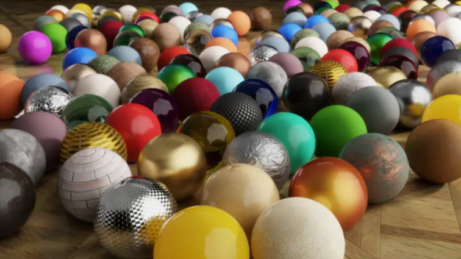

# 3D数字资产

## 1、3D数据格式定义

3D数据格式是用于描述三维几何体、材质、动画、灯光等信息的文件格式。其中，mesh是描述3D模型的网格数据，它由顶点、面、边等组成，可以确定3D模型的外观和形状。材质则是描述模型表面的颜色、纹理、反射率等信息，它们可以使模型更加真实和逼真。动画数据描述模型的动态变化，包括骨骼、关键帧等元素，可以使模型在运动中更加生动。灯光数据则可以影响场景的氛围和气氛，通过光照技术可以实现更真实的场景效果。针对不同应用场景和需求，可以选择适合的3D数据格式。

除了3D数据格式外，还有其他类型的3D资产，如音频、blueprint、模型等。这些不同类型的3D资产可以被广泛应用于游戏、动画、建筑、工程、医学等领域。音频可以增强场景的沉浸感和真实感，使得场景更加生动。Blueprint是一种可视化脚本工具，可以用于快速开发和调试3D应用程序。模型是3D场景的重要组成部分，可以包括各种3D物体、场景等。在管理3D资产时，需要考虑不同类型的资产间的关联和整合，以提供更加全面的服务和支持，满足用户的需求。

## 2、常见数据格式介绍

#### 2.1 通用数据格式

常见的通用3D数据格式包括OBJ、3DS、FBX、STL、Collada、GLTF、USD等。每种格式都有其特定的优缺点和适用场景。

##### 2.1.1 模型数据格式

OBJ（Wavefront OBJ）格式：一种在1980年代早期由Wavefront Technologies开发的开放式3D模型格式。它支持存储仅包含几何信息的模型，因此可用于在不同的3D软件之间交换模型数据。OBJ可以存储三角面片、材质、UV映射和其他基本几何数据，但不支持动画或其他高级功能。由于其广泛的兼容性，OBJ格式被视为一种行业标准，并且支持几乎所有3D软件。

STL（Stereolithography）格式：一种用于保存三角形网格模型的专有格式，最初在1980年代早期由3D Systems开发。它通常用于3D打印和快速原型制作，用于实现快速成型技术。STL格式只能表示表面几何，因此不适用于复杂的CAD模型。尽管如此，STL格式在快速原型制作和3D打印领域得到了广泛应用，并且被大多数3D软件所支持。由于其简单易用和广泛应用的特点，STL格式成为了3D打印和快速原型制作的标准格式之一。

3DS（3D Studio）格式：是Autodesk公司于1988年开发的专有格式，用于保存三维建模数据，支持几何、材质、动画和灯光等信息。它是3D Studio Max软件的主要文件格式，并被许多其他3D软件所支持。由于其成熟的技术和广泛的应用领域，3DS格式在游戏制作、建筑设计和电影特效等领域得到了广泛应用。该格式易于使用，是许多行业中的标准格式之一。

FBX（Autodesk FBX）格式：FBX格式（Autodesk FBX）是一种由Kaydara公司在2000年代初开发，后被Autodesk收购的专有3D模型交换格式。它被广泛用于Autodesk和其他3D软件之间的交换，并且支持几乎所有的3D数据类型，包括几何、材质、动画和灯光。FBX格式还可以保存骨骼、纹理和其他高级功能的信息，因此在动画和游戏行业中得到了广泛应用。由于其广泛的支持和功能，FBX格式成为了3D模型交换的行业标准之一。

Collada（COLLAborative Design Activity）格式：是由Khronos Group于2004年推出的开放格式，用于保存3D场景和模型数据。它支持几何、材质、动画、物理模拟和灯光等信息，并可以在不同的3D软件之间进行数据交换。Collada格式的主要特点是可扩展性和互操作性，能够满足不同行业和应用场景的需求。该格式在游戏制作、虚拟现实和建筑设计等领域广泛应用，被认为是未来3D数据交换的重要标准之一。

GLTF（GL Transmission Format）格式：一种由Khronos Group在2015年开发的基于JSON的格式，用于在WebGL场景中传输3D数据。GLTF格式支持几何、材质、动画、灯光和其他高级功能，并且易于在现代Web浏览器中加载和渲染。该格式被广泛用于实时图形应用程序，如游戏、虚拟现实和增强现实。与其他3D格式相比，GLTF格式具有更小的文件大小和更快的加载速度。它支持多种材质、动画和纹理等信息，并且可以在浏览器中实时加载和渲染。因此，GLTF格式已经成为了Web 3D图形的标准格式之一。

USD（Universal Scene Description）格式：是一种由Pixar Animation Studios在2016年开发的开放式3D数据格式，用于在复杂的3D制作流程中共享数据。USD格式支持多种几何、材质、动画、布局等信息，并且具有高效的多层级场景管理、数据压缩和快速数据读取等优点。USD格式还支持多个软件包，如Houdini、Maya和Katana，使得它非常适合于大规模的图形项目。USD格式是一种非常优秀的3D数据格式，可以为各种不同的应用场景提供高效、灵活、可扩展的解决方案。作为一种新兴的开放式3D数据格式，它具有极高的开放性和可扩展性，使得其在各种不同的3D制作流程中得到广泛应用。USD格式的优点包括：

1. 高效的多层级场景管理：USD格式使用基于节点的数据模型，可以容纳多个3D模型和相关元数据，同时支持复杂的图形场景，这使得它非常适合于大规模的图形项目。
2. 高效的数据压缩：USD格式支持多种压缩技术，可以有效地减少文件大小，并提高文件读取的速度。
3. 快速的数据读取：USD格式使用基于分层的数据访问模式，可以快速地加载和读取复杂的3D场景数据。

##### 2.1.2 材质数据格式

在3D资产中，材质是指物体表面的外观特征，例如表面颜色、光泽度、金属度等等。材质数据格式是描述这些材质信息的格式，包括PBR（Physically-Based Rendering，物理渲染）、NPR（Non-Photorealistic Rendering，非真实感渲染）、MaterialX、MDL（Material Definition Language，材质定义语言）等。

材质渲染的发展历史经历了从最简单的Lambert光照模型渲染到基于物理的渲染（PBR）。下图展示了材质渲染所使用的光照模型的发展历程。

（1）传统光照模型：PBR模型提出之前，材质的着色流程一般使用简单的基于经验的光照模型来模拟。比如Lambert和Phong模型。Lambert模型认为物体表面法向与光源方向越接近，接收到的光照越多。Phong模型则通过环境光（Ambient）， 漫反射光（Diffuse），镜面反射光（Specular） 三个参数组合起来模拟现实中的光照。

(2) PBR (Physically Based Rendering)：

PBR (Physically Based Rendering) 是一种基于物理的渲染技术，它通过模拟现实世界中光线在物体表面的反射和折射，以产生更真实的图像效果。PBR的出现始于1980年，研究者们开始关注到真实感的渲染，如1980年研究员Whitted, T.提出了使用光线追踪的方式来模拟全局光照[1]，用于渲染真实的场景。1982年Cook, R. L和K. E. Torrance提出了著名的 Cook-Torrance BRDF微表面反射模型[2]。并且在后续的研究中，陆续衍生出BTDF、BSDF、BSSRDF等多种材质模型。PBR材质模型可以在不同的光照环境下保证物理上的准确性，因此目前是应用最广泛的材质类型之一。主流的PBR材质方案包括标准PBR、迪士尼BRDF等。

* Blinn-Phong：是改进的传统光照模型，是经验模型，通过人为模拟最终效果，着色公式简单，适合风格化的项目，不适合批量化生产，无法适应各种光照环境。

  
* 标准PBR：趋近真实物理的模型，通过物理测量的数据配合BRDF着色公式达到接近真实的效果。它适合写实类和风格化类项目以及批量化生产，能在各种光照环境下保证物理上的准确性。标准PBR的输入包括漫反射、法线、粗糙度、金属度等贴图，光包括直接光和IBL。输出结果经过线性着色和Tonemaping算法处理，并进行gamma校正。

  
* 迪士尼BRDF：一种常用于渲染引擎中的物理材质模型，它基于分布式热力学模型，通过描述表面的粗糙度和法线分布以及考虑多个散射和反射的成分来模拟各种材质表面的光学效应，比如金属、塑料、绸缎、皮革等。迪士尼BRDF被广泛采用，包括在多个商业渲染引擎和流行的游戏引擎中。

  

  迪士尼动画工作室在SIGGRAPH 2012上著名的演讲《Physically-based shading at Disney》[3]中提出了迪士尼原则的BRDF（Disney Principled BRDF），其优点在于通过少量的参数即可模拟现实中的大部分材质。由于其高度的易用性以及方便的工作流，被电影和游戏业界广泛使用。如2014年《霍比特人：五军之战》电影中的材质渲染。

  

  在实际应用中，迪士尼BRDF已经被广泛采用，包括在多个商业渲染引擎（如Arnold、V-Ray、RenderMan等）中，以及在多个流行的游戏引擎中。它被认为是一种高度灵活和精确的材质模型，可以在不同的应用场景中实现高质量的物理渲染效果。
* 除了迪士尼BRDF之外，其他常见的BRDF方案例如Cook-Torrance BRD、Ward BRDF、Oren-Nayar BRDF、Phong BRDF、Blinn-Phong BRDF等。

  

  

PBR制作流程：数字内容创作（DCC）软件导出的模型资产，导入到SD中预览并生成材质库(按需也可直接输出到引擎或跳过)，使用SD提供的材质库在SP中结合模型资产做精细绘制，导出PBR规格贴图到引擎。

(3) NPR (Non-Photorealistic Rendering)：

NPR材质是一种非真实感渲染技术，与PBR相反，它不是模拟现实世界的光线行为，而是创造出一种非真实的艺术效果。与传统渲染技术相比，NPR材质通常具有更加卡通、手绘的风格，适用于动画电影、游戏、漫画等领域，能够让作品看起来更具有艺术感和个性化。NPR材质的应用范围非常广泛，例如电子游戏《塞尔达传说：荒野之息》就采用了NPR材质来营造游戏的艺术风格。

(3) MaterialX：

MaterialX是一种通用的材质描述语言，它可以跨越不同的3D软件和渲染器，实现材质的共享和转换。MaterialX支持PBR和NPR材质，并提供了丰富的材质节点库和工具集，让艺术家和技术人员可以更加轻松地创建和管理材质。

MaterialX是一种开放标准，旨在创建一个通用的材质资产，可跨平台和环境使用。这个标准最初由Lucasfilm开发，他们希望创建的材质资产可以独立于使用和创建的工具，以便未来对这些资产进行扩展使用。在2017年，他们在GitHub上放出了MaterialX的开源项目供大家使用和参考。

MaterialX的目标是让材质能够在不同的平台和工具中达到一致的效果。为了实现这个目标，MaterialX定义了一系列基于物理的渲染节点，包括分布函数和分层组合两个部分。其中包含三种光的分布函数：BSDF/EDF/VDF，分别定义的是光在表面散射/光从表面或体积中发射/光在体积中散射。

通过Shader Graph，使用MaterialX格式下的材质可以生成复杂的表面材质，并且保证在不同的平台和工具中都能够达到一致的效果。MaterialX的开放标准使得材质的创建和使用更加灵活和自由，为广大的设计师和开发者提供了更多的选择和可能性

MaterialX的分层组合包含了横向和纵向两个方向和组合方式。横向方向对应的是分布函数结果的混合（mix），而纵向则是它们之间的叠加。通过这些分布函数节点的组合，可以生成不同的渲染节点。如下图所示，不同的分布函数按照这两种方向可以组合在一起，从而实现更复杂的表面材质。

MaterialX提供了一个节点库，其中最基本的shading节点是standard_surface。这些节点是通过XML来组织定义的，每个节点都有对应的节点定义（NodeDef），而节点定义对应着其对应的实现（Implementation）。这些节点实现可以是以Node Graph作为实现，也可以指定文件函数，还可以直接通过代码绑定。在MaterialX中，可以充分扩展类型、节点和参数，因此在不同平台中可以通过这个统一标准读取并渲染显示得到统一的效果。MaterialX的开源项目不断更新，并提供了详细的文档说明。通过使用MaterialX，设计师和开发者可以更方便地创建和共享材质，同时也能够更好地保持材质在不同平台和工具中的一致性和稳定性。

(4) MDL (Material Definition Language)：

MDL是一种基于物理的材质描述语言，它由NVIDIA推出，旨在提供一种统一的材质定义和交换标准。MDL可以实现多平台的材质共享和转换，支持PBR和NPR材质，并提供了丰富的材质节点库和工具集。使用MDL可以帮助艺术家和开发人员更轻松地创建和共享复杂的材质定义，提高工作效率和协作性。同时，MDL的物理基础使得所创建的材质更加真实和逼真，可以更好地适用于实时渲染、虚拟现实、增强现实等领域。

MDL是一种基于物理的材质描述语言，由NVIDIA推出，旨在提供一个统一的材质定义和交换标准。其目的在于帮助艺术家和开发人员更轻松地创建和共享复杂的材质定义，提高工作效率和协作性。同时，MDL的物理基础使得所创建的材质更加真实和逼真，可以更好地适用于实时渲染、虚拟现实、增强现实等领域。传统的材质定义存在以下两种问题：

1. 材质无法跨平台共享：
   a. 不同软件使用的材质格式不同，需要进行复杂的转换，从而导致跨软件共享材质的困难；
   b. 不同渲染器使用的图形API和着色器语言不同，使得应用同一种材质到不同平台上时需要提供不同的Shader，进一步增加了跨软件共享材质的复杂度。
2. 同样的材质在不同渲染器上的渲染效果不一致：不同渲染器的着色算法的差异导致材质渲染的效果不同。

为了解决这些问题，NVIDIA于2022年提出了一种新的材质表达方式：MDL。相比于其他着色器语言，MDL具有更高的灵活性和可迁移性。其优势包括：

1. 逼真的渲染和材质模拟：MDL支持多种物理材质模型，包括BSDF（ebidirectional scattering distribution function），EDF（emissive distribution function），VDF（volume distribution function）等。这些模型使得材质更加真实和逼真。
2. 材质跨平台共享：NVIDIA开源了MDL SDK，为渲染器开发者提供了MDL支持。通过接入SDK，材质可以跨平台共享。只需创建一次MDL材质库，即可导入不同的渲染器中以供使用。
3. 材质参数与着色算法分离：  用户可在mdl文件中自定义着色模型和材质参数。并且由于MDL封装了大量材质模型，用户可直接调用，不需要考虑算法细节。通过MDL SDK编译mdl文件，可以直接生成着色模型所对应的glsl，hlsl等着色器代码。保证不同渲染器下使用相同的着色算法。从而解决了不同材质在不同平台表现不一致的问题。

(5) OSL（OpenShaderLanguage）：

OSL（OpenShaderLanguage）是一种免费开源的着色器语言，它由Sony Pictures Imageworks开发，旨在提供一种标准化的方式来编写着色器和纹理。OSL支持多种渲染器，包括Arnold、Blender、RenderMan和Cycles等。使用OSL，用户可以编写复杂的着色器，从而实现更加真实的渲染效果。OSL还具有灵活的自定义性和可扩展性，用户可以自己编写着色器函数和材质节点，从而满足特定的渲染需求。

#### 2.2 动画数据格式

动画数据格式用于存储和传输动画信息，涵盖了多种类型，例如面部动画、骨骼动画和动作捕捉数据等。面部动画主要用于表达角色的面部表情和情感变化，骨骼动画则用于描述角色的姿势和动作，动作捕捉数据则记录人物或物体在现实中的运动轨迹。这些数据格式在游戏、影视、虚拟现实等领域广泛应用，对于提高作品的视觉表现力和真实感至关重要。

#### 2.3 其它数据格式

除了通用数据格式，数字内容创作（DCC）软件还使用专用的数据格式，例如Maya和3ds Max等。这些格式广泛应用于数字内容创作领域，如电影、电视、游戏、动画等。与通用格式相比，这些专用格式具有更高的精度和更好的性能，能够更好地支持各种数字内容的制作和处理。

另外，还有扫描类数据格式，包括点云数据格式和体数据格式。点云数据格式主要用于捕捉真实物体的形状和表面信息，它是通过使用激光扫描仪或结构光扫描仪等设备获取的点云数据，并经过处理和优化后得到的。点云数据通常包含大量的点和法向量信息，能够准确地描述物体的形状和表面特征。体数据格式则主要用于捕捉物体内部的结构和特征，例如医学图像中的CT和MRI数据。体数据格式将物体分为各个体素，每个体素都包含有关物体内部结构的信息，这种数据格式可以在医学、生物学、地质学等领域得到广泛应用。

扫描类数据格式的优点在于能够快速、精确地捕捉真实物体的形状和特征，可以用于数字化现实世界中的对象和场景，为后续的建模、渲染和动画制作提供了有力的支持。

## 3、数据格式的发展和要求

##### 3.1 现有痛点带来的问题

随着3D数据广泛应用，存在的问题变得越来越突出，其中最为明显的是格式不兼容问题。不同的软件和系统使用不同的3D数据格式，导致在传输和共享过程中出现不兼容性和转换成本增加的情况。此外，由于缺乏一个通用的标准格式，数据的质量和可靠性无法得到保障，给用户带来了使用风险。在当前3D数据格式标准不统一的情况下，多人协同、通用格式和便于交换的问题变得更加突出，需要进行繁琐的格式转换和兼容性测试。这限制了数据的价值和可用性，造成了生产力的低效和不必要的浪费。

##### 3.2 未来格式的发展方向

未来格式的发展方向：为了解决现有痛点，未来3D数据格式需要具备更多的特性以满足不断变化的需求。首先，新格式需要具有高兼容性和可互操作性，使得数据可以在不同的软件和系统之间自由流通，从而提高数据的价值和可用性。其次，格式需要具有高扩展性和灵活性，以满足不断变化的业务需求，例如支持各种不同的几何图形和数据类型。未来格式还需要更高的可视化效果和交互性能，以支持更加复杂的3D场景和应用。另外，为了提高数据的安全性和可管理性，新格式需要支持数字版权和访问控制。为了实现这些目标，未来3D数据资产需要一个通用的标准格式，以便于多人协同、便于交换和保证数据质量和可靠性。同时，建立一个数据格式生态联盟和组织运作来推动3D数据格式的发展，促进数据资产的可持续发展，并使得制作、共享和使用3D数据变得更加简便和高效。

##### 3.3 数据格式生态联盟和组织运作

为了更好地推动3D数据格式的发展和应用，建立一个数据格式生态联盟和组织是至关重要的。这个联盟和组织应该由行业协会、技术公司、学术机构和用户组织等共同组成，通过制定和推广标准格式、技术规范和最佳实践等方式，促进3D数据格式的发展和应用。除此之外，联盟和组织还可以促进技术交流和合作，提高行业的创新能力和竞争力。通过这样的努力，可以促进3D数据资产的可持续发展，让制作、共享和使用3D数据变得更加简便和高效，进而推动整个3D行业的健康发展

##### 3.4 未来3D数据资产的要求

未来的3D数据资产需要具备更高的价值和安全性。首先，资产需要具有高品质和可靠性，以满足不同的应用需求。其次，资产需要具备更高的价值和可持续性，以确保投资的回报和效益。最后，资产需要更高的安全性和隐私保护，以防止恶意攻击和数据泄露。为实现这些要求，需要建立完善的3D数据资产管理体系和技术支持体系，为用户提供全方位的服务和支持。

建立完善的3D数据资产管理体系和技术支持体系，需要包括多个方面的内容，例如建立数据资产分类和管理规范、开发高效的数据采集和处理工具、构建安全可靠的数据存储和传输系统、实施严格的数据安全管理措施等。此外，还需要加强数据管理和分析的能力，推广数据智能化应用，提高数据利用率和价值。

总之，未来3D数据资产需要以高品质、可持续性和安全性为基础，建立完善的管理体系和技术支持体系，才能更好地满足各种应用需求，并为用户提供更加可靠和高效的服务。

参考文献：

[1] [Whitted, T. 1980. An improved illumination model for shaded display. Communications of the ACM 23 (6),343–49. ](https://dl.acm.org/doi/10.1145/358876.358882)

[2] [Cook, R. L., and K. E. Torrance. 1981. A reflectance model for computer graphics. Computer Graphics (SIGGRAPH ’81 Proceedings), 15, 307–16.](https://graphics.pixar.com/library/ReflectanceModel/paper.pdf)

[3] [Physically Based Shading at Disney](https://media.disneyanimation.com/uploads/production/publication_asset/48/asset/s2012_pbs_disney_brdf_notes_v3.pdf)
